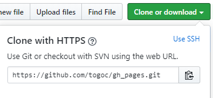

  # serverSetting
   
# 装系统
* 这里选择腾讯云服务器
  

#### 购买安装即可

* 购买后有公网主IP地址:`182.254.195.126`
* 安装可选多种系统
* 本内容安装的是 `Ubuntu`.
* 安装的时候可选 **登录设置**: `密码`/`SSH密钥`,选择不同的方式区别在于后期登录方式不同,**后期不可更改**(密码比较简单,哪种较优不知).
* 下面设置区分  `密码`/`SSH密钥` 两种方式

# 设置

#### 密码登录方式

* 用户名不可选,直接输入密码即可(后续登录服务器就是着这个密码)
* 在网页上登录服务器直接点击`登录`/`标准登录方式`/`端口22`
* 在Xshell上登录服务器: `新建会话`/先输入主机地址(公网ip地址),再点击`用户身份验证`,方法选`Password`,用户名可以在网页登录那里找.

#### SSH登录方式

* 先在网页创建SSH密钥,后下载保存在 `.ssh` 文件夹,再在原网页绑定密钥到服务器实例(如不行到`实例`/`更多操作/加载密钥`那里绑定).
* 绑定完成后即可在网页使用 `密钥` 登录,浏览选择生成下载的那个.
* 在Xshell上登录服务器: `方法` 选 `Public Key`,用户名同上,用户密匙导入下载的那个,密码空,连接即可完成.

#### 同步GitHub文件

* 安装git: `sudo apt-get install git`
##### https方法 
  
  

* 得到一个地址串,然后在服务器运行, `git https://github.com/xxxxx.git` 即可(注意:将同步到当前目录文件夹).
* 进入clone的文件夹, 输入 `git add .`, 以后同步直接输入 `git pull` 就可以啦.

* `git commit` 提交
* `git push -u origin master` 设置分支

##### SSH方法 

### 需要的软件

* Github桌面版下载: [官网](https://desktop.github.com/) 或者 [腾讯云](https://share.weiyun.com/5opM4Qs) 或者 [百度网盘](https://pan.baidu.com/s/15iZCRjez6lY1fCsvVdlDLA)
* Xshell桌面版下载: [腾讯云](https://share.weiyun.com/5moQtKQ) 或者 [百度网盘](https://pan.baidu.com/s/1zXBxDvrVCqmI49y_otGyvg)

